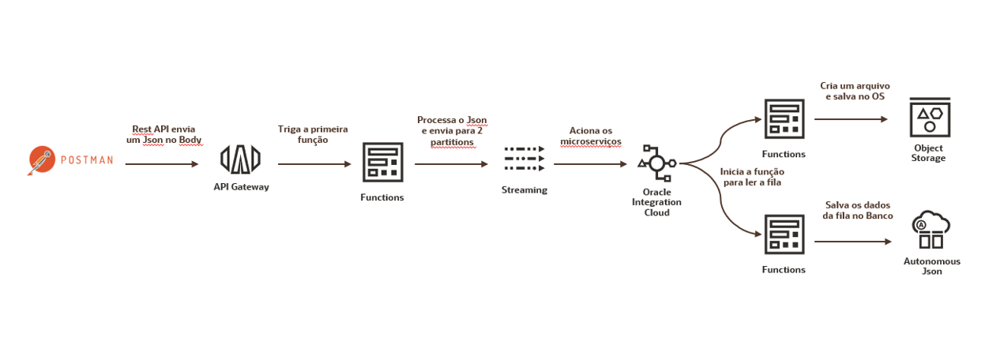
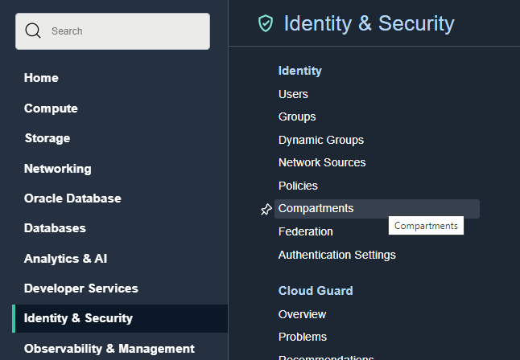
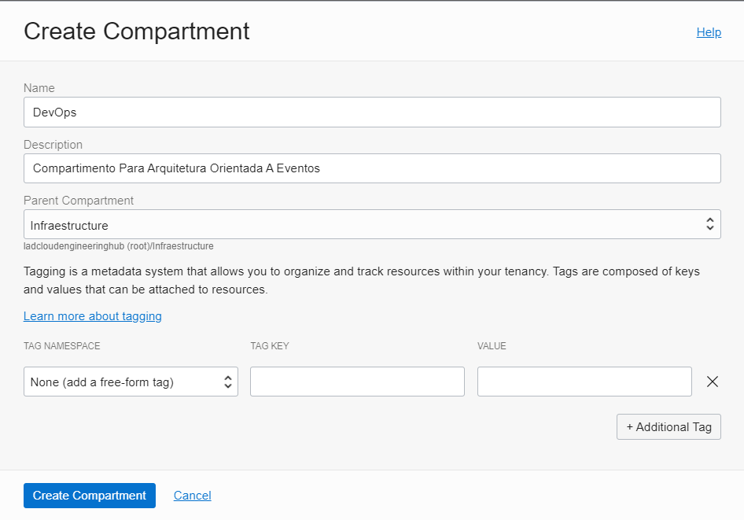
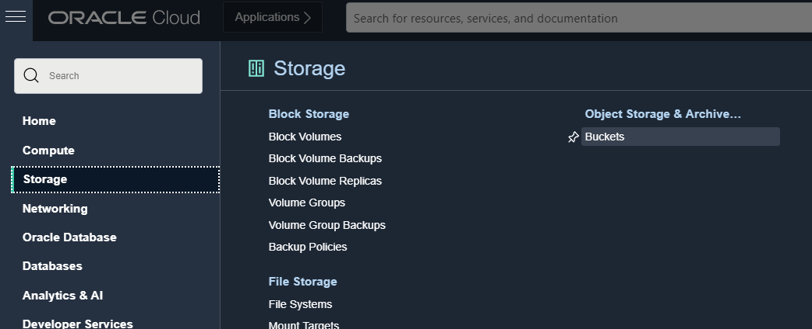
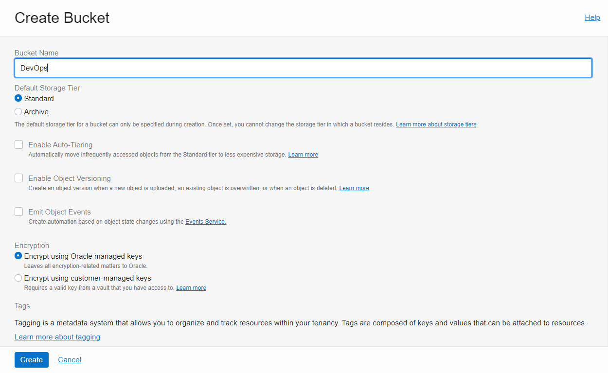
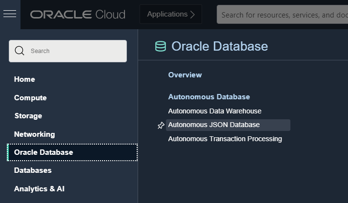
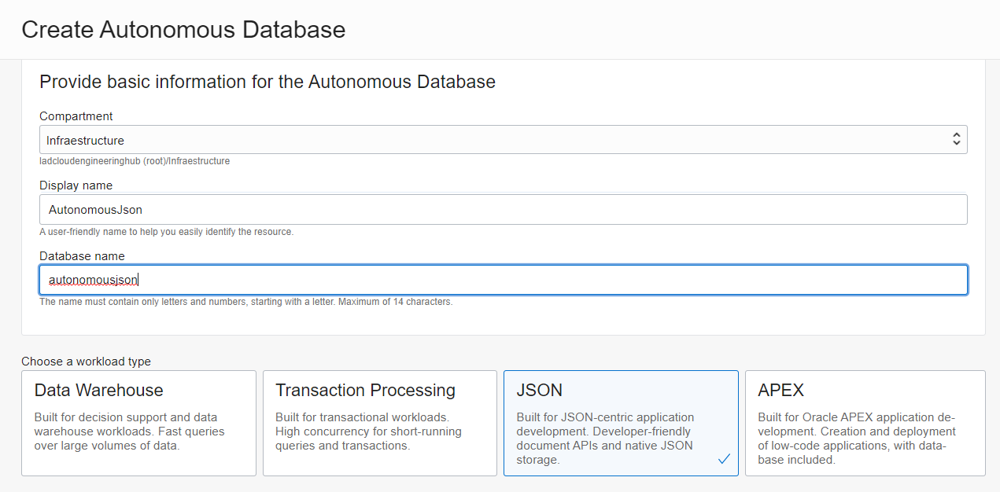
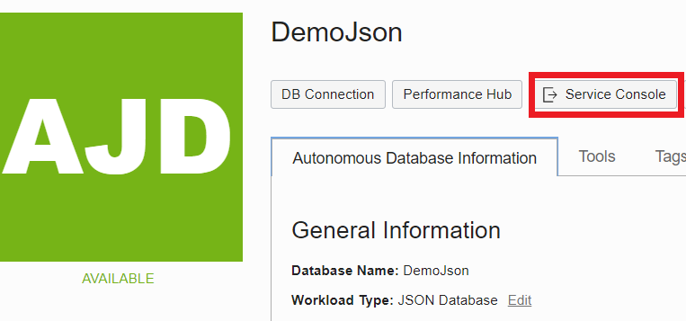
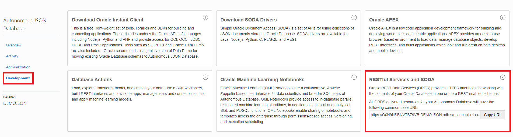

# OCIDevOps

Exemplo de Arquitetura Orientada a Eventos utilizando o Stack Cloud Native do OCI.

## Resumo

Arquitetura Cloud Native orientada a eventos utilizando API Gateway + Functions + Streaming + Connetor Hub. É possivel através desses componentes criar um fluxo de processamento de dados utilizando funções serveless e filas.

## Arquitetura



### Fluxo de dados

- O fluxo se inicia com uma chamada API, onde é utilizado o API Gateway para expor uma função do Functions
- A função é um producer Kafka que recebe os dados da chamada API e joga as informações para cada uma das filas correspondentes do Streaming.
- São utilizadas duas filas, NoSQL e File.
- Connector Hub service trabalha monitorando as filas do Streaming como um Kafka consumer, e quando identifica um novo registro na fila chama a função correspondente de cada uma.
- Na fila NoSQL é acionada a função no Functions que salva os dados que estão na fila dentro do Autonomous Json
- Na fila File é iniciada uma função no Functions que cria um arquivo com os dados e salva esse arquivo em um Object Storage

## Deployment

### Criação da Infra

Serão criados os sequites serviços no OCI:

- [Compartment](#Compartment)
- [Object Storage](#Object-Storage)
- [Autonomous Json](#Autonomous-Json)
- [Streaming](#Streaming)
- Functions
- API Gateway
- [Policies](#Policies)
- Connection Hub 

### Deployment do Código

- Configuração e Deployment do Functions
- Configuração do Connetion Hub
- Configuração do API Gateway
- Teste

## Compartment

Navegando no menu do OCI vá em Identity & Security > Compartimentos:




Agora crie um compartimento para o deploy da arquitetura com o nome de usa preferencia:



## Object Storage

Navegie no menu do OCI vá em Storage > Buckets



Crie um Object Storage Standard com o nome um nome de sua preferência

> :warning: **Crie o Bucket dentro do Compartimento criado anteriormente**



## Autonomous Json

Para criação do Autonomous Json que será o banco NoSQL da arquitetura, navegue no menu do OCI Oracle Database > Autonomous Json Database



Crie um banco Autonomous do tipo JSON:

> :warning: **Crie o Banco dentro do Compartimento criado anteriormente**



Apos a criação do banco vamos pegar o URL do ORDS que será usado posteriormente no código.

Na pagina de informações do Autonomous Json vá em Service Console:



Navegamos para deployment e copianos o link no quadrado de RESTful Services and SODA:



> :warning: **Para facilitar futuras configurações salve esse URL em um bloco de notas**

## Streaming

Vamos criar agora um Streaming Pool para o Streaming e as duas filas:

### Crando o Streaming Pool

### Criando as Filas

## Policies

Vamos criar as políticas necessárias para a execução desse fluxo.

### Permitir que o Functions possa utilizar os recursos de OCI

```
Allow service FaaS to manage all-resources in compartment [Seu Compartimento]
```

### Permitir que o API Gateway liste e utilize o Functions

```
ALLOW any-user to use functions-family in compartment[Seu Compartimento] where ALL {request.principal.type = 'ApiGateway', request.resource.compartment.id = '[OCID do seu compartimento]'}
```