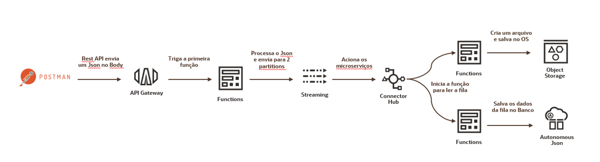

# OCIDevOps

Exemplo de Arquitetura Orientada a Eventos utilizando o Stack Cloud Native do OCI.

## Resumo

Arquitetura Cloud Native orientada a eventos utilizando API Gateway + Functions + Streaming + Connetor Hub. É possível através desses componentes criar um fluxo de processamento de dados utilizando funções serveless e filas.

## Arquitetura



### Fluxo de dados

1. O fluxo se inicia com uma chamada API, onde é utilizado o API Gateway para expor uma função do Functions
2. A função é um producer Kafka que recebe os dados da chamada API e joga as informações para cada uma das filas correspondentes do Streaming.
3. São utilizadas duas filas, NoSQL e File.
4. Connector Hub service trabalha monitorando as filas do Streaming como um Kafka consumer, e quando identifica um novo registro na fila chama a função correspondente de cada uma.
5. Na fila NoSQL é acionada a função no Functions que salva os dados que estão na fila dentro do Autonomous Json
6. Na fila File é iniciada uma função no Functions que cria um arquivo com os dados e salva esse arquivo em um Object Storage

## Deployment

### Criação da Infra

Serão criados os seguintes serviços no OCI:

- [Compartment](#Compartment)
- [Networking](#Networking)
- [Object Storage](#Object-Storage)
- [Autonomous Json](#Autonomous-Json)
- [Streaming](#Streaming)
- [Registry](#Registry)
- [Functions](#Functions)
- [API Gateway](#API-Gateway)
- [Policies](#Policies)

### [Deployment do Código](#Deployment-do-Código)

- [Configuração e Deploy do Functions](#Configuração-e-Deploy-do-Functions)
- [Configuração do Configuração do Service Connector Hub](#Configuração-do-Service-Connector-Hub)
- [Configuração do API Gateway](#Configuração-do-API-Gateway)

### [Teste da Infra](#Teste-do-Sistema)

# Criação da Infra

## Compartment

Navegue no menu do OCI vá em **Identity & Security > Compartimentos**


Agora crie um **Compartment** para o deploy da arquitetura com o nome de usa preferencia:


## Networking

Crie uma **VCN** (Virtual Cloud Networking), onde sera feito o deploy do Functions, API Gateway e do endpoint privado do Stream.

Navegue no menu do OCI, vá em **Networking > Virtual Cloud Networking**


Crie a rede através do **Wizard** sem a necessidade de colocar alguma informação específica, além do nome.

> :warning: **Crie a VCN dentro do Compartimento criado anteriormente**


Com a rede criada adicione 2 regras a **Security List Default** da rede:

1. Habilitando a comunicação dentro da VCN para qualquer máquina e qualquer porta.


2. Habilitando a comunicação com a internet na porta 443 para o Api Gateway 


## Object Storage

O **Object Storage** será o destino final dos dados de uma das filas.

Navegue no menu do OCI vá em **Storage > Buckets**


> :warning: **Crie o Bucket dentro do Compartimento criado anteriormente**

Crie um Object Storage **Standard** com o nome um nome de sua preferência


## Autonomous Json

Para criação do **Autonomous Json** que será o banco NoSQL da arquitetura, navegue no menu do OCI Oracle **Database > Autonomous Json Database**


Crie um banco Autonomous do tipo **JSON**:

> :warning: **Crie o Banco dentro do Compartimento criado anteriormente**


Após a criação do banco, vamos pegar o URL do **ORDS** que será usado posteriormente no código.

Na pagina de informações do Autonomous Json vá em **Service Console**:


Navegue para **Deployment** e copiamos o link no quadrado de **RESTful Services and SODA**


> :warning: **Para facilitar futuras configurações salve esse URL em um bloco de notas**

## Streaming

Será criado agora um **Stream Pool** para e as duas filas, necessárias.

### Crando o Stream Pool

No menu do OCI vá para **Analytics & AI > Streaming**


No menu lateral selecione a opção **Stream Pools**


E criar um novo Stream Pool, onde serão criadas as filas. Crie o Pool com **Endpoint Público** e selecione a VCN e a Subnet Pública criada anteriormente.

> :warning: **Crie o Stream Pool no Compartimento criado anteriormente**


### Criando as Filas

De volta ao menu principal do **Streaming**, dessa vez em **Streams** no menu lateral


Serão criados dois Streams, no Stream Pool que criamos no passo anterior:

> :warning: **Crie os Streams no Compartimento criado anteriormente**

1. Chamado **Object Storage**


2. Chamado **NoSQL**


## Registry

Crie um **OCI Registry** onde as Docker Images do Functions serão armazenadas no OCI.

Navegando no menu do OCI vá em **Developer Service > Container Registry**


Crie um novo repositório, lembrando que no nome deve conter apenas letras minusculas e sem caractéres especiais.

> :warning: **Crie o Registry no Compartimento criado anteriormente**


## Functions

Crie agora uma nova aplicação no **Oracle Functions**, essa aplicação será o agrupamento lógico das funções que serão utilizadas para inserir e tratar os dados de cada fila.

Navegando no menu do OCI vamos em **Developer Services > Applications**


Criar a nova aplicação na VCN e Subnet Pública Criada anteriormente.

> :warning: **Crie a Aplicação no Compartimento criado anteriormente**


## API Gateway

API Gateway vai ser o elemento que nos permitirá realizar chamadas Functions de forma mais simples, nesse caso sem autenticação. Ele vai ser o ponto de entrada de dados no fluxo que estamos criando.

Navegue no menu do OCI vá em **Developer Services > API Managemnt**


Agora crie o Gateway na Subnet Pública da VNC criada anteriormente.


## Policies

Crie as **Policies** necessárias para a execução desse fluxo.

### Permitir que o Functions possa utilizar os recursos de OCI

```
Allow service FaaS to manage all-resources in compartment [Seu Compartimento]
```

### Permitir que o API Gateway liste e utilize o Functions

```
ALLOW any-user to use functions-family in compartment[Seu Compartimento] where ALL {request.principal.type = 'ApiGateway', request.resource.compartment.id = '[OCID do seu compartimento]'}
```

# Deployment do Código

## Configuração e Deploy do Functions

Para facilitar o deployment do código, utilize o **Cloud Shell** para fazer o deployment das funções na Aplicação do functions.

### Acessando Cloud Shell

No canto superior direito da Console do OCI, pode ser encontrado o botão do **Cloud Shell** entre a Region e o ícone de alerta do OCI.


Um terminal abrirá na parte inferior do navegador


### Clonando o Projeto

Já temos o **GIT** instalado no Cloud Shell, utilize o seguinte comando para clonar os códigos para o cloud shell

```
git clone https://github.com/ChristoPedro/OCIDevOps.git
```

### Configurando o fn Client

Configure o client do fn no cloud shell.

#### Gerando Auth Token

Primeiro é preciso gerar um **Auth Token** para seu usuário conseguir logar no OCI Registry.

1. Na console do OCI click no icone de usuário no canto superior direito, e depois no seu nome de usuário.


2. Na página do seu usuário procure no menu lateral **Auth Token**. Depois Click em gerar um novo Token. Só é necessário dar um nome qualquer ao token.


> :warning: **Copie o token assim que for gerado e salve em algum lugar onde possa recupera-lo. Ele só fica disponível no memoento que é gerado!**


#### Gerando Configurações do fn Client

Com o token salvo podemos voltar na página da aplicação do **Functions** que foi criado anteriormente. Lá teremos um passo a passo de configuração do ambiente para o **Cloud Shell**.

1. No menu do OCI vá em **Developer Services > Applications**


2. Selecione a aplicação criada anteriormente e no menu lateral vá em **Getting Started**


3. Siga as instruções copiando e colando cada passo no **Cloud Shell** até o passo:

```
fn list apps
```

---
**OBS**

No momento que for executar o passo de fazer login no Docker. Utilize o Auth Token como senha.

---

## Fazendo o Deployment das Funções

Primeiro acesse a pasta clonada do git hub

```
cd OCIDevOps
```

### Producer:

Acesse a pasta do producer:

```
cd producer
```

Depois edite o arquivo [func.yaml](producer/func.yaml) para adicionar os seguites parâmetros do stream:
- Password
- Server
- User

Apos a edição do arquivo faça o deploy da função:

```
fn deploy --app [Nome da Função]
```

---
**OBS**

Também é possível fazer o deploy no modo verbose, onde conseguimos acompanhar passo a passo da compilação da docker image da função

```
fn deploy --app [Nome da Função] --verbose
```
---

### Consumer Object Storage:

Acesse a pasta do consumer:

```
cd consumer
```

Depois edite o arquivo [func.yaml](consumer/func.yaml) para adicionar os seguites parâmetros do stream:
- BuecktName

Apos a edição do arquivo faça o deploy da função:

```
fn deploy --app [Nome da Função]
```

### Consumer NoSQL:

Acesse a pasta do consumer NoSQL:

```
cd consumerNoSQL
```

Depois edite o arquivo [func.yaml](consumerNoSQL/func.yaml) para adicionar os seguites parâmetros do stream:
- dwpassword
- dbuser
- schema
- ordsbaseURL
- schema

Apos a edição do arquivo faça o deploy da função:

```
fn deploy --app [Nome da Função]
```

### Transform:

Acesse a pastar da função transform:

```
cd transform
```

Faça o deploy da função:

```
fn deploy --app [Nome da Função]
```

## Configuração do Service Connector Hub

O **Service Connector Hub** atuará como um listener da fila do **Streaming** e acionará as funções quando houverem registros a serem processados.

Nessa arquitetura será adicionado também uma função transform no **Service Connector Hub** para fazer o decode da mensagem do **Streaming** que é codificada em Base64.

No meu do OCI navegue **Analytics>Service Connector HUB**


### Service Connector Object Storage

Crie um novo Service Connector selecionando Streaming como Source e Functions como target.


Selectione o Stream Pool criado anteriormente e o stream dedicado ao Object Storage


Na parte de **Task** configuration selecione a Task do tipo Function, depois vamos selecionar a Function Application criada anteriormente e a função **transform** para ser executada.


Configure o **Target** para a Function Application criada anteriormente e selecione a função **consumer**.


### Service Connector Banco NoSQL

Siga os passos da configuração anterior, porém trocando na parte do **Source** o stream do Object Storage pela stream **NoSQL**, e a função **Target** de consumer para **consumernosql**

## Configuração do API Gateway

Navegue até o **API Gateway** criado anteriormente:

**Developer Services > Gateways** 

Agora o **API Gateway** será configurado para expor o serviço do **Producer**. A ideia é que a chamada API seja o **evento** que inicie todo o processo da arquitetura.


Selecione o API Gateway navegue até **Deployments** no menu do lado esquerdo.


Crie um novo Deployment. Na primeira págia só é necessário preencher as informações do **Basic Informations**.
- **Name:** O nome que quer dar para o deployment
- **Path Prefix:** O Path que virá apos o base URL
- **Compartment:** Seleciona o compartimento que já está sendo utilizando no lab


Na parte de configuração de rotas, vamos configurar apenas uma rota, a do Producer, utilize os seguintes parametros:

- **Path:** /producer
- **Methods:** POST
- **Type:** Oracle Functions
- **Application:** [Nome da Função Criada Anteriormente]
- **Function:** Producer


Clique em **next** e depois crie o Deployment

# Testando o Sistema

Quando o deployment estiver concluido será possível encontrar e copiar o endpoint do Deployment na console do OCI.


Agora é possivel testar a chamada através de um curl, trocando o **[Base Path]** no código abaixo pelo endpoint do Deployment.

```
curl --location --request POST '[Base Path]/producer' \
--header 'Content-Type: application/json' \
--data '{
    "File":{"Dados": "Dados de Arquivo"},
    "NoSQL": {"Dados": "Dados de NOSQL"}
}'
``` 
.

> :warning: **A primeira chamada pode demorar um pouco para retornar alguma coisa, isso ocorre devido ao cold start do Functions**
